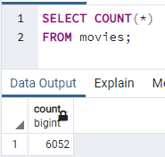
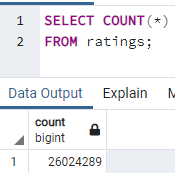

# Movies-ETL

Movies-ETL is a program that extracts data from different databases, transfroms the data into usable data by connecting the data through the IMDB movie key, and loads the data into a PostgreSQL database called movies. This database contains two tables, a movie table containing over 6000 movies and their details, and a ratings table, containing all user ratings for all movies.

### Environment:
- Python 3.7.x
- Jupyter Notebook
- PostgreSQL

### Content:

##### Movie Table Row Length:

##### Ratings Table Row Length:

